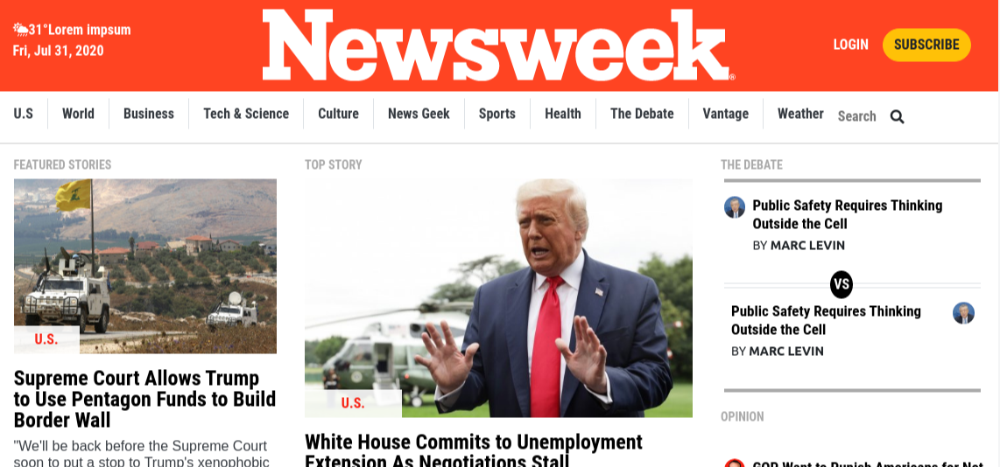

# NewsWeek Clone with Bootstrap 4.5

> This project has been built with Bootstrap 4.5. We used minimal CSS. It has been a very teaching experience.

Additional description about the project and its features.

## Built With

- HTML
- Bootstrap 4.5
- CSS3
- Font awesome icons

## Live Demo

[Live Demo Link](https://mkrtichsargsyan.github.io/newsweek-bootstrap/)

## To get a local copy up and running follow these simple example steps.

### Setup

Clone the project locally.

### Linters

1. run `npm install`.
2. run `npm run test` to check the Html and CSS files.

### Deployment

Install and run a live server plugin on you IDE/Text editor and run it from the root directory.

## Authors

👤 **Mkrtich Sargsyan**

- Github: [@githubhandle](https://github.com/MkrtichSargsyan)
- Twitter: [@twitterhandle](https://twitter.com/MkrtichSargsyan)
- Linkedin: [linkedin](https://www.linkedin.com/in/mkrtich-sargsyan-921ab0152/)
- Email:  mkrtichsargsyan24@gmail.com

👤 **Gürbüz Ertunga**

- Github: [@githubhandle](https://github.com/gurbuzertunga)
- Linkedin: [linkedin](https://www.linkedin.com/in/gurbuz-ertunga-a607a2a5/)
- Email:  gurbuzertunga@gmail.com

## Show your support

Give a ⭐️ if you like this project!

## 📝 License

This project is [MIT](lic.url) licensed.
